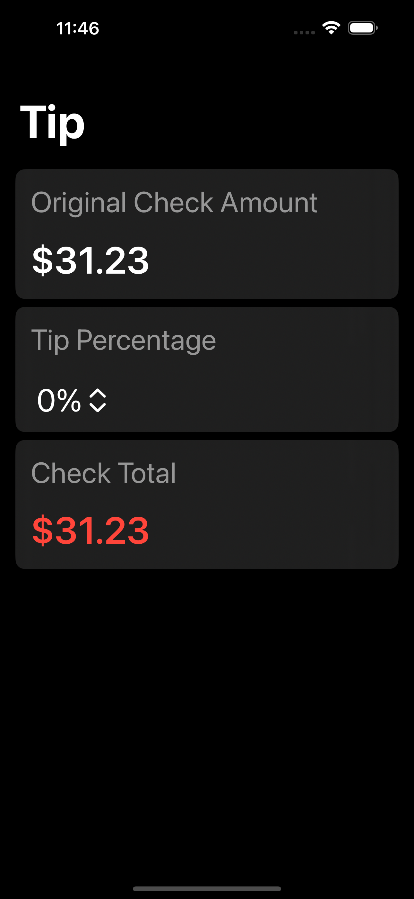
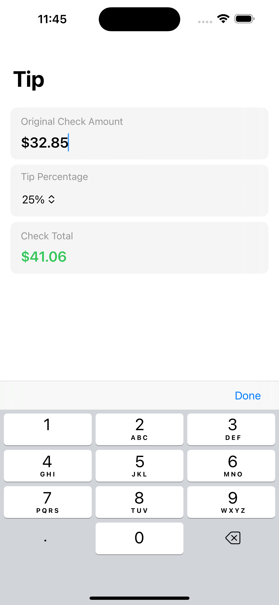

## Tipper - Tip Calculator
A simple and accessible tip calculator built with SwiftUI. Supports Dynamic Type for enhanced accessibility.

### Screenshots
      

### Features
- **Dynamic Type Support** - Adjusts content to user's preferred text size without truncation and clipping.
- **Real-Time Calculations** Automatically updates tip amount as you type.
- **Simple & Clean UI** - Minimal, native iOS design.

### Technology Used
- **Swift** - Core language
- **SwiftUI** - UI framework

### How to Run
1. Clone the repository.
```
git clone https://github.com/DTeakell/Tipper.git
```
2. Open in Xcode.
3. Build and run on an iPhone simulator or physical device.

### Requirements
- **Xcode 15 +**
- **iOS 16 +**

